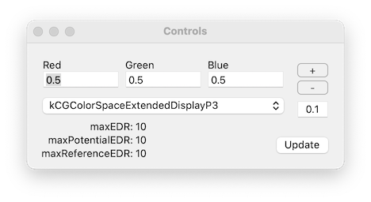

# EDR tester

This is a simple modification of the Apple sample code called [`MetalKitAndRenderingSetup`](https://developer.apple.com/documentation/metal/using_metal_to_draw_a_view_s_contents?language=objc)

It adds a few lines to make the buffer half-float and enable EDR, and has a control window to set the RGB values and `CGColorSpace`. It also displays the values of `maximumExtendedDynamicRangeColorComponentValue`, `maximumPotentialExtendedDynamicRangeColorComponentValue` and `maximumReferenceExtendedDynamicRangeColorComponentValue`. Buttons are provided to nudge the RGB values up and down by a selectable step.

The purpose of the app was to investigate the behaviour of macOS colour management, by measuring the XYZ values of the patch with a colorimeter to ascertain the EOTF used in various display modes.

## Usage Example
Testing whether the EOTF applied to a window tagged as sRGB is the piecewise sRGB curve or pure 2.2 gamma.

1. Set the colour space tag in the drop-down to `kCGColorSpaceExtendedSRGB`
2. Measure `white_luminance` with RGB set to {1.0, 1.0, 1.0}
3. Measure `black_luminance` with RGB set to {0.0, 0.0, 0.0}
4. Measure `test_luminance` with RGB set to {0.04, 0.04, 0.04}
5. Calculate `normalised_luminance = (test_luminance - black_luminance) / (white_luminance - black_luminance)`
6. If the result is approximately `0.04 / 12.92 = 0.0031` the EOTF is likely to be piecewise
7. If the result is approximately `0.04 ** 2.2 = 0.00084` the EOTF is likely to be 2.2 gamma
8. If in doubt, take samples across a range of values and plot them against the two curves

